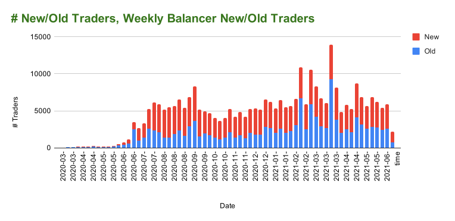
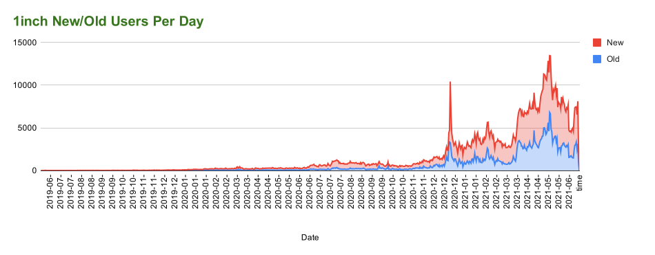
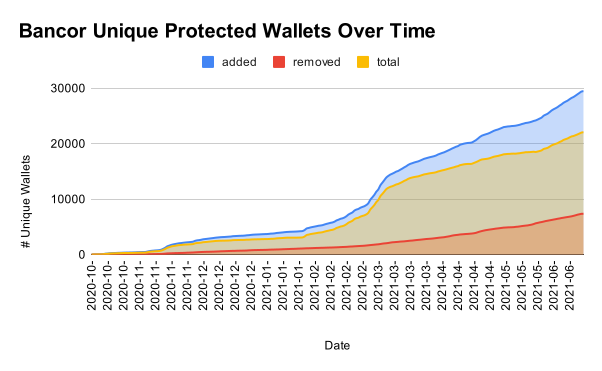

# Dune Analytics

[](https://www.python.org/downloads/release/python-390/)

[](https://opensource.org/licenses/Apache-2.0)

[](https://github.com/itzmestar/duneanalytics/actions/workflows/python-package.yml)
<hr style="border:0.5px solid gray"> </hr>

### Unofficial Python Library for [Dune Analytics](https://duneanalytics.com/)

The library can be used to fetch the table data from `python` backend.

#### Disclaimer: Use at your own risk! 
It may not work for some/all urls.

This library doesn't run the query, rather it fetches the query result from the backend.

<hr style="border:0.5px solid gray"> </hr>

### Charts Plotted:
Here are some examples of charts plotted in Googlesheet after fetching the data.

-----

[**@balancerlabs / Balancer New/Old Traders**](https://duneanalytics.com/queries/31203/62900)



-----

[**@k06a / 1inch New/Old Users Per Day**](https://duneanalytics.com/queries/1193/2032)



-----

[**@Bancor / Bancor Unique Protected Wallets Over Time**](https://duneanalytics.com/queries/12948/25894)



<hr style="border:0.5px solid gray"> </hr>

### Installation:

use pip to install:

``` 
pip install duneanalytics
```

<hr style="border:0.5px solid gray"> </hr>

### Authentication:

You need to have `username` & `password` for [Dune Analytics](https://duneanalytics.com/)

<hr style="border:0.5px solid gray"> </hr>

### Example usage:

```
from duneanalytics import DuneAnalytics

# initialize client
dune = DuneAnalytics('username', 'password')

# try to login
dune.login()

# fetch token
dune.fetch_auth_token()

# fetch query result id using query id
# query id for any query can be found from the url of the query:
# for example: 
# https://dune.com/queries/4494/8769 => 4494
# https://dune.com/queries/3705/7192 => 3705
# https://dune.com/queries/3751/7276 => 3751

result_id = dune.query_result_id(query_id=5508)

# fetch query result
data = dune.query_result(result_id)
```
